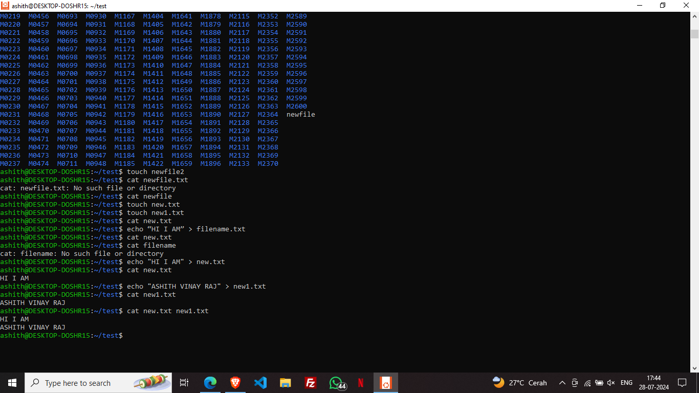

# Marvel-Level-0-Report

# Generic Tasks

## Ashith Vinay Raj \| ECE \| Batch 27’

## TASK 1:3D PRINTING

In this task I learned about 3D printing with PLA, slicing STL files using Ultimaker Cura, and adjusting settings like bed temperature and infill density.

The 3D printer melts the plastic filament “PLA” and deposits it according to the instructions from the slicing software.

I learned the basic knowledge about it such as:

1.  **Printing Material**:The types of filament or resin the printer uses (e.g., PLA,PETG) and their properties, such as temperature requirements and print characteristics.
2.  **Printer Settings**:Key settings like layer height, infill density, print speed, and bed temperature, as they directly affect print quality and durability.
3.  **Slicing Software**:Slicing softwares (e.g., Ultimaker Cura) to convert 3D models into instructions such that the printer can understand, adjusting settings to optimize my print.Top of FormBottom of Form

## TASK 2: API

# HOME PAGE

# 

# 

# SONG SEARCH

An Application Programming Interface (API) is a set of protocols and tools that allows different software applications to communicate and interact with each other.

APIs define how requests for data or services should be made and how responses should be formatted, enabling seamless integration between systems.They play a crucial role in modern allowing developers to utilize external functionalities without having to build them from scratch.

In this task I created a music application which uses the Spotify API to fetch the song and its lyrics from the server.

Firstly,I created the basic layout of the home page using HTML.Then I added a simple CSS to it which resembles to spotify.

Next,I created a javascipt file and added the spotify API key in it ,which I took from the ‘Spotify For developers’ site.

Then I learnt about the async,await and promises which are used in JS to carry out regular functions as asynchronous functions.

Then I added the js function to play the song preview (as the complete song causes a copyright strike) and a function to fetch its lyrics using jsonand ajax calls.

This is the link to the code -https://github.com/ashith-17/Music-API.git

Although it was quiet difficult understanding this,I enjoyed creating the API!

## Task 3:WORKING WITH GITHUB

PULL REQUEST:

FORK:

In this I learnt about GitHub integrated workflows (GitHub actions), Issues, and pull requests.

I performed the given task in the Readme file.

I forked the given repository into my repository “marvel-git-task” and then cloned the repository. I created a new Branch under the name "marvel" and fixed the failing error. The error was being caused due to the "+1" in main.py file. The correction is as shown below from the GitHub Desktop below. Then I staged the repo for commit and commited my changes and pushed the new branch into my GitHub where I had forked the original repository using Git Bash. I then issued a pull request to merge with the main branch.

ERROR CORRECTION:

## TASK 4:UBUNTU COMMAND LINE

It is a free operating system that is used in major data repository. Getting in command with ubuntu taught me many commands like which are used to create a folder or store some information in that folder.

● The mkdir command to create a folder

● The cd command(change directory) for is used to navigate to the directory.

● The touch command is used to create new files.

● The ls command is used to display the list of files.

● The cat command is used to reads files sequentially, displaying their content to the terminal.

## TASK 5:KAGGLE CONTEST

Understood the given data in the train file and predicted the outcome of survival of the remaining passengers aboard the Titanic in the test csv file and logged the data in a new csv file called submission.csv. I used the **random forest model**. This model is constructed of several "trees" that will individually consider each passenger's data and vote on whether the individual survived. Then, the random forest model makes a democratic decision: the outcome with the most votes wins!

## TASK 6:PANDAS AND MATPLOTLIB

I generated a random dataset using the random function of Numpy and plotted the Pie charts,histogram,Line Bar and Scatter plots. The graphs are as shown above.

Firstly,I imported the libraries matplotlib.pyplot used for creating plots and charts.numpy used for generating and manipulating numerical data.

LEARNINGS:

np.random.seed() is a function in the NumPy library. It is used to seed the random number generator, which ensures that the random numbers generated by NumPy are reproducible. By setting the seed, we get the same random numbers each time we run the code with that seed value.

This is the link to the code-https://github.com/ashith-17/Matlplotlib.git

## TASK 7-CREATE A PORTFOLIO WEBPAGE

I created a website to showcase my portfolio - about myrself, interests, projects, social media profiles and more. It is responsive and also pushed to the git repository.I used simple HTML,CSS and js for the webpage.I still haven’t modified it.

This is the link to the code - https://github.com/ashith-17/portfolio-website.git

TASK 8:RESOURCE ARTICLE USING MARKDOWN

TASK INCOMPLETE

TASK 9:TINKERCAD

I created a tinkercad account, got familiar with the application, understood the example circuits given and simulated a simple circuit using an ultrasonic sensor to estimate the distance between an obstacle and the sensor. The result is displayed above!

I created a radar system utilising an ultrasonic sensor and servo motor to detect objects within a certain range. The ultrasonic sensor emits sound waves and measures the time taken for them to bounce back, while the servo motor rotates the sensor to cover a wider area, providing a simple yet effective detection mechanism.

LINK-https://www.tinkercad.com/things/iSRMnViSbxK-copy-of-marvel-task- 9?sharecode=TBMWoNxBv6EWd3kOJAyeWXsfSnVqjZOev_2urxoQfyE

## TASK 10:SPEED CONTROL OF DC MOTOR

About maincomponents L298N:

The L298N is a dual H-bridge integrated circuit (IC) commonly used for controlling DC motor direction and speed with an Arduino board.It can handle two DC motor and one bipolar stepper motor.By applying different logic signals (HIGH or LOW) to these pins, you can control the direction of rotation and enable/disable the motor.

Arduino:

It is a circuit board which allows the user to program inorder to control the electronic components like DC motors.

It helps in the method of Pulse Width Modulation which is a technique where a digital signal rapidly switches between on and off states.The ratio of the on time to the total cycle time (period) determines the average voltage delivered to the motor.By varying the pulse width using Arduino's PWM pins, we can control the average voltage supplied to the motor, thereby affecting its speed.

Other components

● DCMotor(voltage and current rating compatible with L298N)

● JumperWires

● PowerSupply(voltage suitable for your motor)

Key Learnings:

● I learnt about the L28N and Arduino Uno briefly

● Learnthowtocontrol the speed of the dc motor.

● Learnt how to use the bread board

● Additionally learnt another way of speed controlling i.e. varying voltage supply

● Addedthecodetotheunousing C++

## TASK 11:

TASK INCOMPLETE

## TASK 12:SOLDERING PREREQUISITES

It is process of joining two metals using a filler.This process is commonly used in electronics to solder components like pins and wires in order to keep the circuit closed I soldered a led bulb into the circuit board.

## TASK 13:555 IC MULTIVIBRATOR

The IC timer is a integrated circuit which is used a s an oscillator,timer and pulse width modulation signals.The objective was to obtain 60% duty output and observe the output on the DSO(oscilloscope).I meade the required connections as shown by the reference using the breadboard and jumper wires.

Ground (GND): Connects to circuit's ground like negative on a battery.

Trigger (TRG): Starts the timer in one-shot mode or influences it in others.

Output (OUT): Where the timer signal comes out (pulse, wave, or on/off).

Reset (RESET): Pushes the timer to stop and clear, like a big red button.

Control (CTRL): Fine-tune timing speed in some modes

Threshold (THR): Works with trigger to set the timing finish line. Discharge (DIS): Helps clear the timer after a pulse or offers advanced control.

Power (VCC): Plugs the chip in, like connecting it to a power source.

OTHER COMPONENTS: COMPARATORS: It is a device that compares voltage of the inputs and outputs indicating whichever of its input is larger.

This is the logic circuit inside the IC.

Key learnings: I studied the components and the logic behind an 555 IC and its uses.Made the connections as provided in the reference and got the output.

## TASK 14: K MAPS AND DERIVING THE LOGIC CIRCUIT

I found out the results of the Truth Table given that is the Buzzer activates when the door is locked and the key is pressed and when the door is open and the key is not pressed. Then found the SOP K-Map as shown above and derived the function defining the logic circuit. I then derived the logic circuit as shown above. Using Tinkercad I simulated the logic circuit.

## TASK 15 :ACTIVE PARTICIPATION

● I have almost attended every tech event,webinar and fests like Impetus.

● I completed with front end -web development and I am continuing to learn the back end of it.Further,I will study Machine learning.
